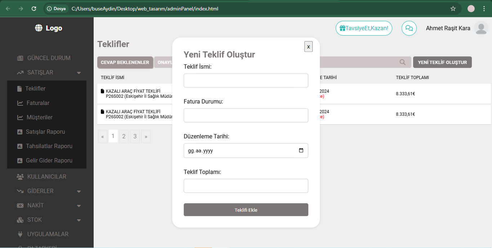

Based on the work I received through the Bionluk platform, I coded the desired pages using html, css and javascript. They did not want me to use a 3rd party connection to view the pages. I used template to display pages dynamically.

## Projeden görseller

